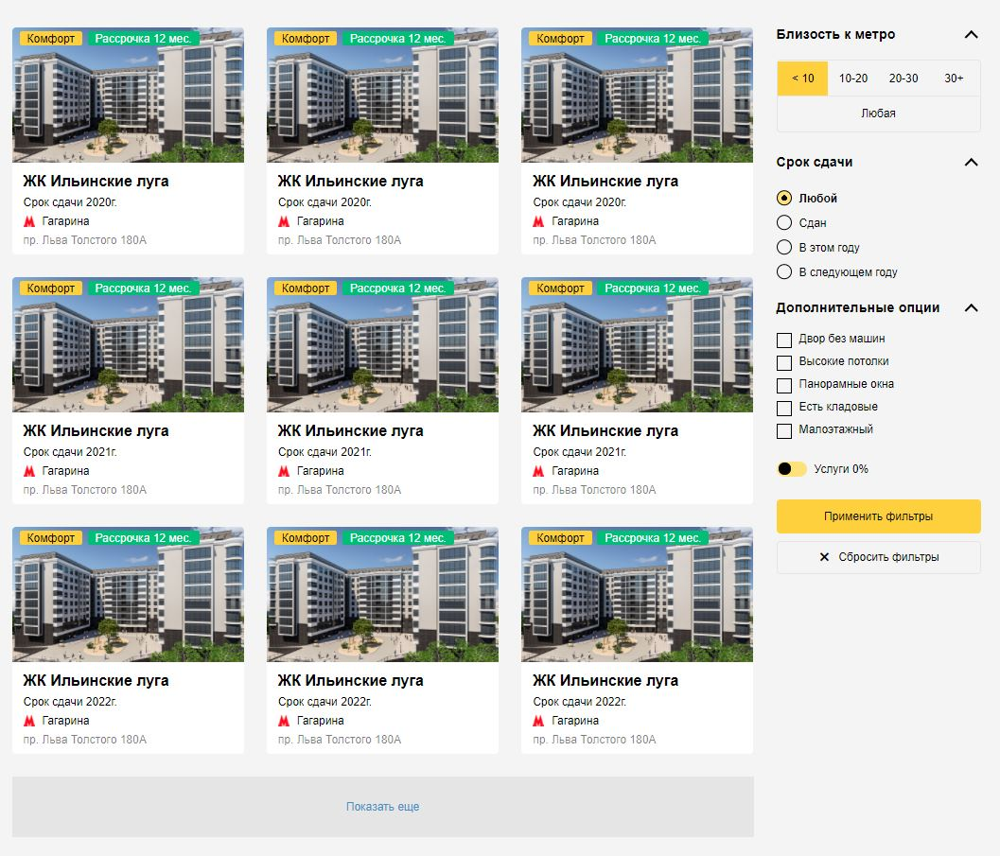

# JS-app "Realtor"

## Description
My coding practice with pure JS(ES6+), DOM API, HTML/CSS.



## Getting Started

#### Installation
Before start, you need install project dependencies:
```
npm install
```

#### Usage
```
npm start
```

#### Other scripts
Build project:
```npm run build```


